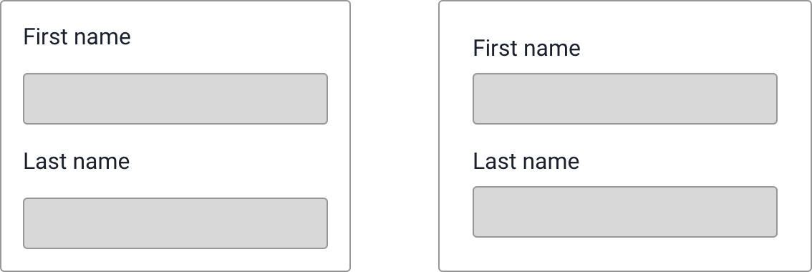
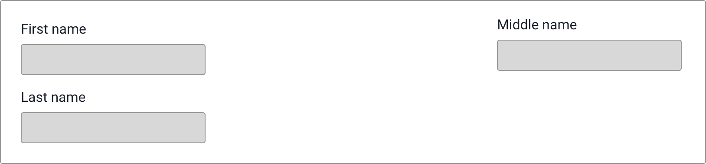
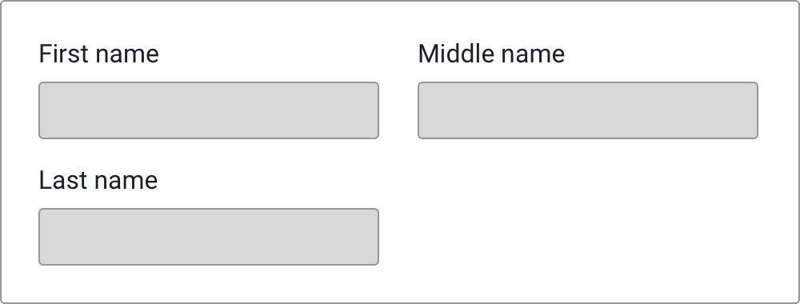
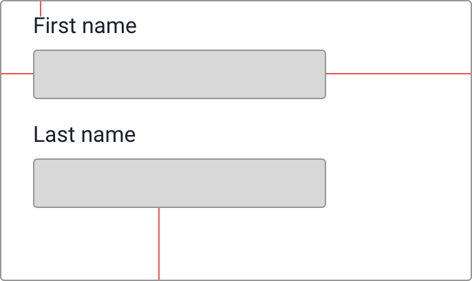
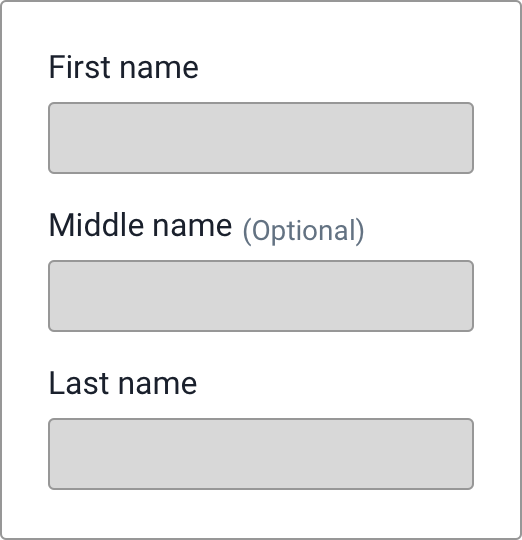

 

## Before you begin

Download sketch (if you don't already have it). The sketch files provided all use the Google Font, Roboto.

Install the [FontBuddy](https://github.com/AnimaApp/FontBuddy/blob/master/FontBuddy.zip) sketch plugin. When you open sketch documents, you'll be able to install the missing fonts.

## Exercise 1 - Introduction to sketch

Open sketch-dev-day-warmup.sketch and follow the instructions for each exercise.

## Exercise 2 - Design fundamentals

Now that you're someone familiar with sketch, we're going to look at some simple designs and start fixing their issues. This dev day isn't focused towards design fundamentals, but we'll cover the 3 most common mistakes so that we can understand them and fix the issues in the mockups. 

Without further ado, the 3 most fundamental (and easily correctable) mistakes in design are:

### Spacing

There are 4 common problems seen with spacing.

1 - Things that belong together should be closer together

In the example on the left, the labels and the inputs are 1rem apart. The padding between the elements and their container is also 1rem. This makes it hard to tell what belongs together. This issue is corrected in the example on the right where the padding on the container is the largest (1.5rem), followed by the spacing between the fields (1rem), followed by the spacing between the label and it's input (.5rem).

2 - Things should not be needlessly far apart 

In this example, middle name is very far away from the other inputs. It certainly shouldn't be any further away than the container padding of 1.5rem.

Here is a more reasonable amount of spacing:

3 - Spacing should be consistent 

In this example, the spacing between the elements and their container is different. Certainly there wouldn't be a reason for the top, left, and bottom padding to match.

4 - Not using enough space

It's very temping to use cards and border and backgrounds to separate logical groupings. Every element you add to the page (a border, a background color) makes your design more complicated. Whitespace can be used instead and will help simplify your designs.

### Alignment
   
Designs with high levels of alignment appear organized and as if care was put in to the design. Designs without alignment can be confusing and look disorganized.  

In this example, the word 'Optional' is not aligned with the label 'Middle name'. Ideally, the text would be aligned at their baseline.

### Visual Hierarchy

Visual hierarchy is more generally referred to as contrast. You create visual hierarchy by emphasizing important elements, and de-emphasizing less important elements. With text, this might be achieved by font weight, font color, or font size.

The next exercises you'll be asked to fix drawing with these 3 common design problems. 

Open sketch-dev-day-fundamentals.sketch and follow the instructions for each exercise.

### Exercise 3 - Website mockup
One of the most outrageous websites I've come across recently, is the [Yale School of Art](https://www.art.yale.edu/). Navigate around the site and pick aspects that you want to incorporate into your design. Do a sketch mockup using a subset of their content to create a proposal for a site overhaul. We will share our designs at the end of the day.
